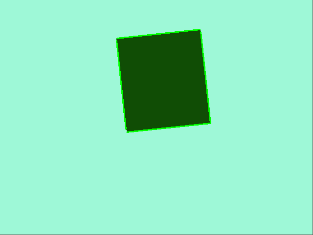

# Поиск координат углов прямоугольника на изображении при помощи преобразования Хафа
Реализовать поиск координат углов прямоугольника при помощи классического преобразования Хафа на изображении, полученным при помощи класса из п.1. Привести листинг программы и 5 примеров работы (изображение, результаты вычислений, оценка точности). Будет большим плюсом реализация визуализации аккумулятора Хафа + визуализация найденных прямых на исходном изображении.

Чтобы получить линии Хафа на изображении использовалась библиотека OpenCV, и библиотека skimage для получения визуализации аккумулятора Хафа.  

## Визуализация аккумулятора Хафа
```ruby
accumulator, thetas, rhos = hough_line(img)
plt.figure(figsize=(10,10))
plt.imshow(accumulator)  
```
  
Визуализация найденных прямых функцией `cv2.HoughLines.png`  
  
Визуализация найденных сторон прямоугольника функцией `cv2.HoughLines.png`  
  


Получение линий Хафа  
```ruby
edges = cv2.Canny(gray,50,150,apertureSize = 3)
lines = cv2.HoughLinesP(edges,1,np.pi/180,100,minLineLength=100,maxLineGap=10)
```
Так как функция выдает координаты всех сторон прямоугольника (то есть 8), написана функция, оставляющая уникальные координаты прямоугольника.  
```ruby
def uniq_coord(coord):
    thr = 5
    list = []
    for i in range(len(coord)):
        for j in range(i+1, len(coord)):
            if abs(coord[i][0] - coord[j][0]) < thr and abs(coord[i][1] - coord[j][1]) < thr:
                list.append([i,j])
    uniq = np.array(list)[:,0]
    return coord[uniq]
```

## Примеры работы программы:  
1. Изображение  
  
Координаты сторон прямоугольника  

[361, 398],  
[531, 326],  
[316, 289],  
[484, 218]  

Абсолютная погрешность предсказания координат  
```ruby
MAE = 1
```
2. Изображение  
  
Координаты сторон прямоугольника  

[226, 235],  
[246, 375],  
[ 42, 404],  
[ 22, 264]  

Абсолютная погрешность предсказания координат  
```ruby
MAE = 5
```
3. Изображение  
  
Координаты сторон прямоугольника  

[187, 145],  
[399, 186],  
[356, 411],  
[144, 370]  

Абсолютная погрешность предсказания координат  
```ruby
MAE = -1
```
4. Изображение  
  
Координаты сторон прямоугольника  

[205,  82],  
[274, 238],  
[112, 310],  
[ 43, 154]  

Абсолютная погрешность предсказания координат  
```ruby
MAE = 0
```
5. Изображение  
  
Координаты сторон прямоугольника  

[ 65, 373],  
[221, 290],  
[163, 182],  
[  6, 265]  

Абсолютная погрешность предсказания координат  
```ruby
MAE = -1
```
